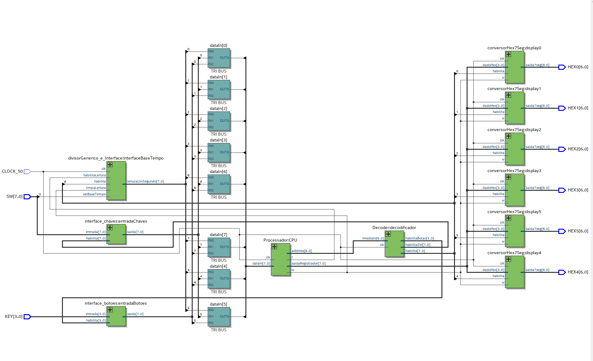

# Relógio 

*Repositório para entrega do projeto de um relógio da disciplina Design de Computadores*

### Proposta:

Um relógio feito em assembly e VHDL.

### Hardware:
 
- `FPGA DE0-CV` 

### Funcionamento:
- **SW0**: Essa chave permite a escolha da base de tempo. Quando ela está acionada (valor 1), a base de tempo escolhida é a mais rápida, e quando o valor está 0, a base é 
a mais devagar. 
- **SW1**: Essa chave permite pausar o relógio, assim é possível acertar o horário. Quando ela está acionada (valor 1), o relógio pausa, caso contrário ele continua funcionando.
- **SW2**: Essa chave permite escolher o formato do relógio, AM/PM ou 24 horas. Quando a chave está acionada (valor 1), o formato escolhido é AM/PM. O led indica se é AM ou PM, quando o led está aceso é PM. 
- **SW3**: Essa chave permite começar o temporizador. Quando só essa chave está ativada o temporizador começa a contagem regressiva com a base de tempo normal. Se quiser ver a contagem regressiva com a base de tempo rápida tem que acionar a SW0 também. 
- **KEY0**: Quando a função está na função de pause, ou seja a SW0 está acionada, esse botão quando pressionado zera o relógio inteiro. 
- **KEY1**: Quando a função está na função de pause, ou seja a SW0 está acionada, esse botão quando pressionado adiciona 1 nos minutos. 
- **KEY2**: Quando a função está na função de pause, ou seja a SW0 está acionada, esse botão quando pressionado adiciona 1 nas horas. 

### Fluxo de Dados:

### Requisitos:

- **C**
    - [X] Indica horas, minutos e segundos:
        - [X] O horário deverá ser mostradp através do display de sete segmentos
    - [X] Possui algum sistema para acertar o horário
    - [X] Possui seleção da base de tempo
    
- **Extras**

    - [X] Indicação do horário com base em 12 horas -AM/PM
    - [ ] Sistema de despertador
    - [X] Temporizador com contagem regressiva
    - [x] Montador (assembler) para o processador criado:
        - [x] Deve ser em Python
    - [ ] Pilha controlada por hardware (instruções push e pop no processador):
        - [ ] Pode ter a posição fixa na memória (não precisa iniciar o ponteiro da pilha).
    - [ ] Instrução de chamada de sub-rotina com um nível:
        - [ ] Não precisa atender chamadas aninhadas, ou seja, sem recursão;
        - [ ] O endereço de retorno, pode ser armazenado na pilha ou em registrador específico.
        - [ ] O destino pode ter como referência o PC ou ser absoluto.
